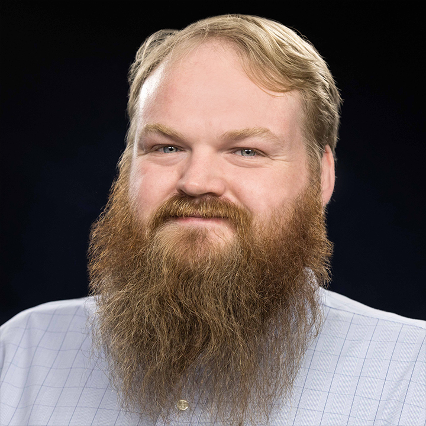

I am a fifth year graduate student at the Harvard-Smithsonian Center for Astrophysics. My research interests are mainly in the area of electromagnetic follow-up of gravitational wave events detected by the Advanced LIGO and VIRGO instruments. In a previous life I was a filmmaker and photographer, working in and around Baltimore, MD and Washington D.C. 

Contact Me
-----------
+ E-mail - pcowpert@cfa.harvard.edu
+ Office - +617-495-4141 
+ Post - 60 Garden Street, MS-10, Cambridge, MA 02138 